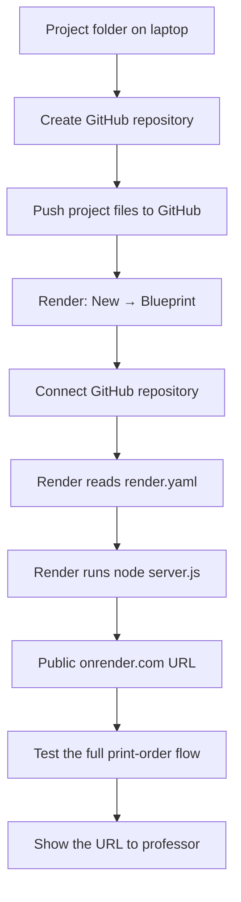
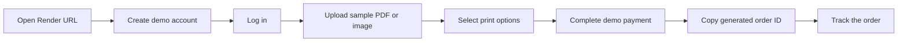

# Deploy Xerox Centre on Render (Free)

This guide deploys the project as a public website for a demonstration.

> **Free-tier note:** Render may sleep after 15 minutes without visitors. Opening
> the site again can take about a minute. Files, users, and orders saved by this
> project can be removed if the free service restarts or is redeployed. Use only
> sample documents and a demo account.

## Deployment flow



## Part 1: Put the project on GitHub

### A. Create an empty repository

1. Open [GitHub](https://github.com) and sign in.
2. Click the **+** icon, then **New repository**.
3. Repository name: `xerox-centre-ait`.
4. Choose **Public**.
5. Leave **Add a README file**, **Add .gitignore**, and **Choose a license** unchecked.
6. Click **Create repository**.
7. Copy the repository URL. It looks like:

   ```text
   https://github.com/YOUR_GITHUB_USERNAME/xerox-centre-ait.git
   ```

### B. Run these commands in Terminal

Open Terminal and copy/paste these commands **one at a time**. The first command
opens this project folder.

```bash
cd "/Users/sumit/Downloads/xerox-fullstack 3"
```

```bash
git init
```

```bash
git add .
```

```bash
git commit -m "Prepare Xerox Centre for Render deployment"
```

Replace `YOUR_GITHUB_USERNAME` below with your GitHub username, then copy/paste:

```bash
git branch -M main
git remote add origin https://github.com/YOUR_GITHUB_USERNAME/xerox-centre-ait.git
git push -u origin main
```

If GitHub asks you to sign in, complete the sign-in in the browser or follow the
prompt in Terminal. Refresh your GitHub repository page when the command finishes.
You should see `server.js`, `render.yaml`, and the `public` folder.

## Part 2: Deploy on Render

1. Open [Render](https://render.com) and sign in with GitHub.
2. Click **New** in the top-right corner.
3. Choose **Blueprint**.
4. Select the `xerox-centre-ait` repository.
5. Render finds the `render.yaml` file automatically.
6. Click **Apply**.
7. Wait until the status says **Live**.
8. Click the generated `https://...onrender.com` URL.

The deployment uses these project settings automatically:

```text
Runtime: Node
Plan: Free
Build command: echo "No build step required"
Start command: node server.js
Health check: /
```

## Fallback: create a Web Service manually

Use these steps only if the Blueprint option does not detect the repository.

1. In Render, click **New → Web Service**.
2. Connect and select the GitHub repository.
3. Enter exactly these values:

| Setting | Value |
| --- | --- |
| Name | `xerox-centre-ait` |
| Language | `Node` |
| Branch | `main` |
| Build Command | `echo "No build step required"` |
| Start Command | `node server.js` |
| Instance Type | `Free` |

4. Click **Create Web Service**.
5. Wait for the service to become **Live**, then open its public URL.

## Part 3: Test before showing your professor

Use the following demonstration flow:



Checklist:

- Open the website 5–10 minutes before the presentation.
- Keep a small sample PDF or image ready to upload.
- Use a fresh test account such as `demo@example.com`.
- Do not use a real card number; the payment screen is only a demo.
- Keep a screenshot or screen recording as a backup.

## If the deployment fails

1. Open the service in Render.
2. Click **Logs**.
3. Confirm the log contains:

   ```text
   Xerox Centre server running
   ```

4. Confirm the Start Command is exactly:

   ```text
   node server.js
   ```

5. Confirm `render.yaml` is located at the top level of the GitHub repository.
